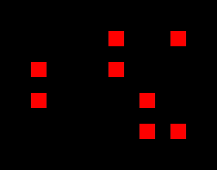
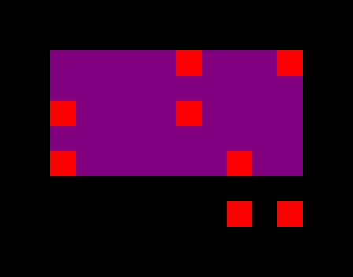
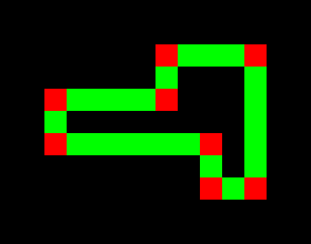
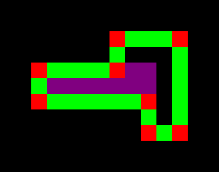
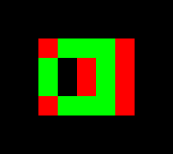
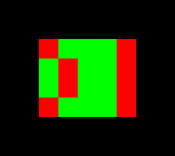
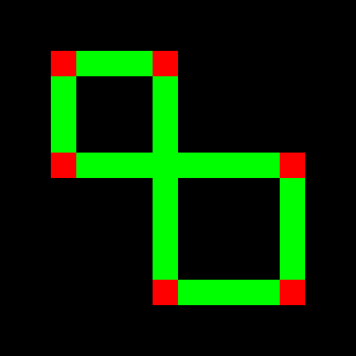
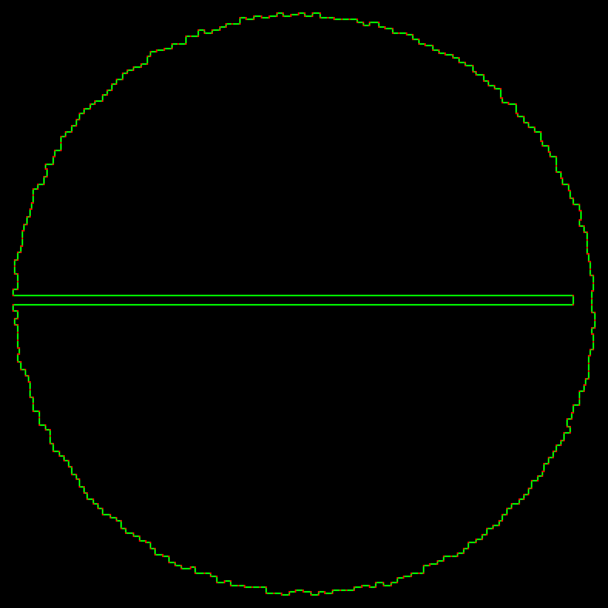
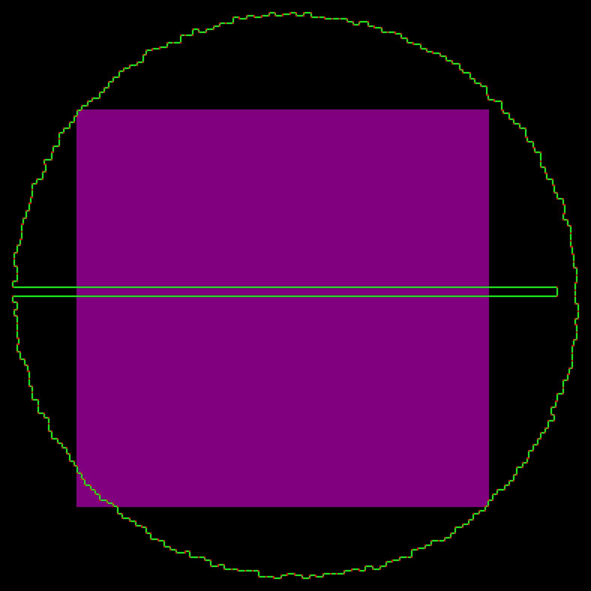
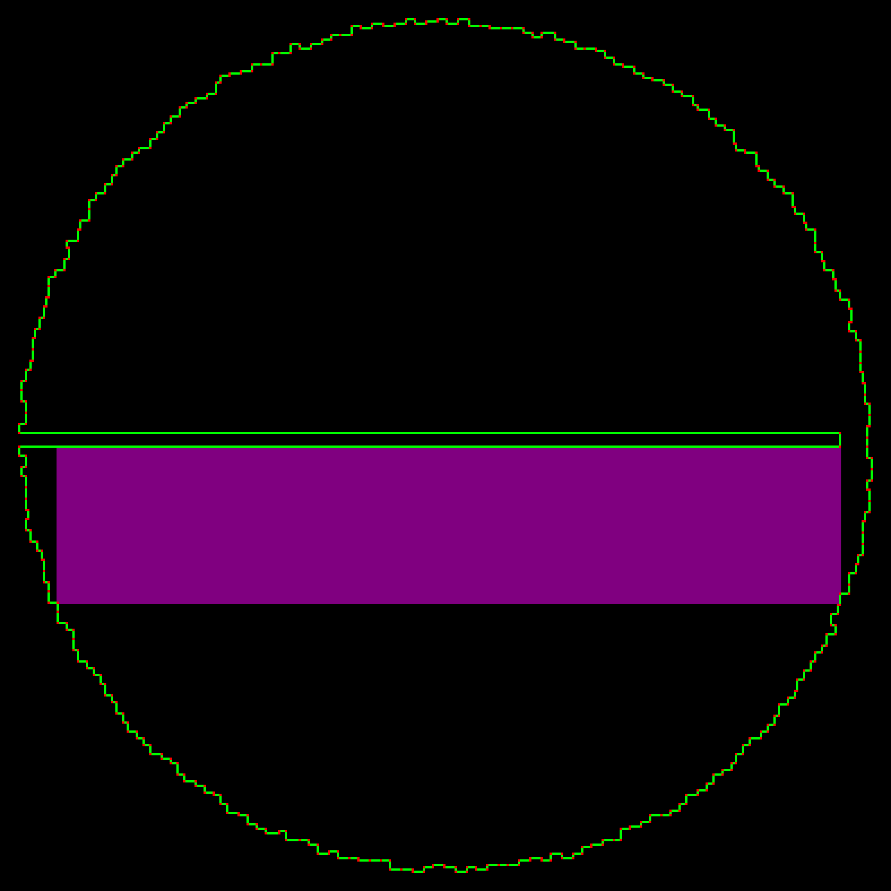

## Parsing:

The parsing mostly the same as seen in previous days. nothing special here

```hs
type Input = [(Int, Int)]

parseInput :: String -> Input
parseInput = map (read . (++ ")") . ("(" ++)) . lines
```

## Part 1:

Now for the exercises.

In part one we are asked to find the size biggest rectangle such that 2 of its opposite corners belong to the input



So for this example set, the solution would be:



For this problem, we just need to create a list of pairs of points, map to their size and find the biggest one.

```hs
pairs :: [a] -> [(a, a)]
pairs l = [(x, y) | (x : l) <- tails l, y <- l]

size :: (Num a) => (a, a) -> (a, a) -> a
size (x, y) (x', y') = (abs (x - x') + 1) * (abs (y - y') + 1)

part1 :: Input -> Output
part1 = maximum . map (uncurry size) . pairs
```

## Part 2:

Now for part2, it gets trickier.

We have more constraints for this puzzle :

The points are now tracing a shape on the floor, and the square cannot get out of that shape.



So for the same input, we now have this solution:



Here comes the hard part, the coordinates span over 100_000 positions both in width and in height. So it makes it impossible to generate a grid and color it by hand to check if the rectangle is always inside the shape.

If you wanted to make the perfect solution, you would land on several problems:

### Problems

#### Filled shape

Technically, from the subject we could have a shape that has tiles which fill the grid, the shape would be closed, but then we would need to check every pixel to verify that the shape fills that gap.

A valid input could be :



Where we have a gap in the middle so the big rectangle (5x4) is not a valid solution.

On the other hand we could also have this:



Where the gap is filled and the big rectangle (5x4) is a valid solution

#### Loops

Another hard issue would be loops.

What if you had an 8 shaped, how to tell when you are still inside or out ?




This is why I decided to vibe code the script `visualize.py`, in order to take a look at the actual input and find more information that would help me solve the problem more rapidly.

(Might try at the end of AoC to code it by hand in Haskell)



```sh
python3 ./visualize.py -o input.png --up-scale 4 --down-scale 256 input.txt --padding 8
```

This representation tells us that there is no loops inside the shape nor is there any filling using tiles.

This means that any rectangle containing a red tile inside necessarily has outside tiles inside as well.

So a first version filtering most rectangle could be:

```hs
-- For convenience sort the coordinates of the bounds
-- from the two xy coordinates, sort them so that x < x' and y < y'
limitsOf ((x, y), (x', y')) = ((min x x', min y y'), (max x x', max y y'))

-- Check that the coordinates xy'' don't belong strictly inside the rectangle xy xy'
inSqr ((x, y), (x', y')) (x'', y'') = x < x'' && x'' < x' && y < y'' && y'' < y'

part2 :: Input -> Output
part2 redTiles = uncurry size . head  $ filter noneDirectlyIn sortedPairs
  where
    -- No red tiles are strictly inside the rectangle
    noneDirectlyIn xyxy' = not $ any (inSqr (limitsOf xyxy')) redTiles

    -- Get the pairs sorted, so that the first valid is the result
    sortedPairs = reverse . sortOn (uncurry size) $ pairs redTiles

```

But here, with the visualization, we can see an issue: the line in the middle, there is no red tile strictly inside the inscribed rectangle (somewhat like the [first solution](#results-visualizations) if we omit the bottom left corner).

Since we now that no lines are right beside the other and that the line crosses most of the circle, we can take a mid point at the bottom side of each square and verify that we do not encounter any green line until the other side.


Here is the code simplified to focus on the new updates.

```hs
-- Check
inRow ((x, y), (x', y')) (x'', y'') = y'' == y && x < x'' && x'' < x'

part2 :: Input -> Output
part2 redTiles = uncurry size . head . filter (uncurry limitNbSides . limitsOf) $ pairs redTiles
  where
    -- Get all the lines of the input
    greenLines = map limitsOf $ zip redTiles (tail redTiles ++ [head redTiles])

    -- Filter the rows since here we move parallel to them (both y are the same)
    greenRows = filter (uncurry (==) . both snd) greenLines

    limitNbSides :: (Int, Int) -> (Int, Int) -> Bool
    limitNbSides (x, y) (x', y') = not $ any (uncurry (hitSides (x, y) (x', y')))
        [(((x + x') `div` 2, y + 1), (0, 1))] -- Here we could add more points if need be

    hitSides :: (Int, Int) -> (Int, Int) -> (Int, Int) -> (Int, Int) -> Bool
    hitSides (x, y) (x', y') (x'', y'') dxy
      | (y'' == y') = False -- End condition, we reached the other side of the square without any line
      | any (flip inRow (x'', y'')) greenRows = True -- If the current point belong to any row, it's invalid
      | otherwise = hitSides (x, y) (x', y') (x'' + fst dxy, y'' + snd dxy) dxy -- If none hit, move the point and continue
```

To make the code usable with more inputs I decided to do the same with columns in case the line is vertical

```hs
inCol ((x, y), (x', y')) (x'', y'') = x'' == x && y < y'' && y'' < y'
inRow ((x, y), (x', y')) (x'', y'') = y'' == y && x < x'' && x'' < x'

part2 :: Input -> Output
part2 redTiles = uncurry size . head . filter (uncurry limitNbSides . limitsOf) $ pairs redTiles
  where
    greenLines = map limitsOf $ zip redTiles (tail redTiles ++ [head redTiles])

    greenCols = filter (uncurry (==) . both fst) greenLines
    greenRows = filter (uncurry (==) . both snd) greenLines

    noneDirectlyIn xyxy' = not $ any (inSqr (limitsOf xyxy')) redTiles

    limitNbSides (x, y) (x', y') = not $ any (uncurry (hitSides (x, y) (x', y'))) [(((x + x') `div` 2, y + 1), (0, 1)), ((x + 1, (y + y') `div` 2), (1, 0))]

    hitSides (x, y) (x', y') (x'', y'') dxy
      | dxy == (0, 1) && (y'' == y') = False
      | dxy == (1, 0) && (x'' == x') = False
      | dxy == (1, 0) && any (flip inCol (x'', y'')) greenCols = True
      | dxy == (0, 1) && any (flip inRow (x'', y'')) greenRows = True
      | otherwise = hitSides (x, y) (x', y') (x'' + fst dxy, y'' + snd dxy) dxy
```

But if we analyse a bit what we do, for each rectangle and for each position inside the rectangle we check if we hit every row or column, an easy optimization would be to just look for rows and columns that are at the same level and for which only the min and max bound checks would be needed.

Here is the code for the rows:

```hs
inRow ((x, y), (x', y')) (x'', y'') = y'' == y && x < x'' && x'' < x'

part2 :: Input -> Output
part2 redTiles = uncurry size . head . filter (uncurry limitNbSides . limitsOf) $ pairs redTiles
  where
    greenLines = map limitsOf $ zip redTiles (tail redTiles ++ [head redTiles])

    greenRowsList = filter (uncurry (==) . both snd) greenLines
    -- Creating a Map with the y coordinate of the rows and the list of rows at these coordinates
    greenRows = M.fromAscList
        $ map (\((xy, xy') : l) -> (snd xy, (xy, xy') : l))
        $ groupBy (curry (uncurry (==) . both snd)) -- grouping if Y coordinates are equal
        $ sortOn (snd . fst) greenRowsList -- need to sort since groupby works on consecutive values

    noneDirectlyIn xyxy' = not $ any (inSqr (limitsOf xyxy')) redTiles

    limitNbSides :: (Int, Int) -> (Int, Int) -> Bool
    limitNbSides (x, y) (x', y') = not $ any (uncurry (hitSides (x, y) (x', y'))) [(((x + x') `div` 2, y + 1), (0, 1))]

    hitSides :: (Int, Int) -> (Int, Int) -> (Int, Int) -> (Int, Int) -> Bool
    hitSides (x, y) (x', y') (x'', y'') dxy
      | (y'' == y') = False
      -- Need to check if there are any rows at this y coordinates, if there is checking hit on any of these
      | M.member y'' greenRows && any (flip inRow (x'', y'')) (greenRows M.! y'') = True
      | otherwise = hitSides (x, y) (x', y') (x'' + fst dxy, y'' + snd dxy) dxy
```


### Results Visualizations




```sh
python3 ./visualize.py -o res-part1.png --up-scale 4 --down-scale 256 input.txt --padding 8 --rect 82919,85891,12644,18423
```



```sh
python3 ./visualize.py -o res-part2.png --up-scale 4 --down-scale 256 input.txt --padding 8 --rect 5939,50158,94553,67789
```

## Complete Code:

```hs
type Input = [(Int, Int)]

parseInput :: String -> Input
parseInput = map (read . (++ ")") . ("(" ++)) . lines

pairs :: [a] -> [(a, a)]
pairs l = [(x, y) | (x : l) <- tails l, y <- l]

size :: (Num a) => (a, a) -> (a, a) -> a
size (x, y) (x', y') = (abs (x - x') + 1) * (abs (y - y') + 1)

part1 :: Input -> Output
part1 = maximum . map (uncurry size) . pairs

inSqr :: (Ord a) => ((a, a), (a, a)) -> (a, a) -> Bool
inSqr ((x, y), (x', y')) (x'', y'') = x < x'' && x'' < x' && y < y'' && y'' < y'

limitsOf :: (Ord a, Ord b) => ((a, b), (a, b)) -> ((a, b), (a, b))
-- limitsOf ((x, y), (x', y')) = ((min x x', min y y'), (max x x', max y y'))
limitsOf ((x, y), (x', y')) -- Not really nice looking version but much faster
  | x' < x = limitsOf ((x', y), (x, y'))
  | y' < y = ((x, y'), (x', y))
  | otherwise = ((x, y), (x', y'))

inCol :: (Ord a) => ((a, a), (a, a)) -> (a, a) -> Bool
inCol ((x, y), (x', y')) (x'', y'') = x'' == x && y < y'' && y'' < y'

inRow :: (Ord a) => ((a, a), (a, a)) -> (a, a) -> Bool
inRow ((x, y), (x', y')) (x'', y'') = y'' == y && x < x'' && x'' < x'

part2 :: Input -> Output
part2 redTiles = uncurry size . head . filter (uncurry limitNbSides . limitsOf) $ filter noneDirectlyIn sortedPairs --
  where
    greenLines = map limitsOf $ zip redTiles (tail redTiles ++ [head redTiles])

    greenCols = M.fromAscList . map (\((xy, xy') : l) -> (fst xy, (xy, xy') : l)) . groupBy (curry (uncurry (==) . both fst)) . sortOn (fst . fst) $ filter (uncurry (==) . both fst) greenLines
    greenRows = M.fromAscList . map (\((xy, xy') : l) -> (snd xy, (xy, xy') : l)) . groupBy (curry (uncurry (==) . both snd)) . sortOn (snd . fst) $ filter (uncurry (==) . both snd) greenLines

    limitNbSides :: (Int, Int) -> (Int, Int) -> Bool
    limitNbSides (x, y) (x', y') = not $ any (uncurry (hitSides (x, y) (x', y'))) [(((x + x') `div` 2, y + 1), (0, 1)), ((x + 1, (y + y') `div` 2), (1, 0))]

    hitSides :: (Int, Int) -> (Int, Int) -> (Int, Int) -> (Int, Int) -> Bool
    hitSides (x, y) (x', y') (x'', y'') dxy
      | dxy == (0, 1) && (y'' == y') = False
      | dxy == (1, 0) && (x'' == x') = False
      | dxy == (1, 0) && M.member x'' greenCols && any (flip inCol (x'', y'')) (greenCols M.! x'') = True
      | dxy == (0, 1) && M.member y'' greenRows && any (flip inRow (x'', y'')) (greenRows M.! y'') = True
      | otherwise = hitSides (x, y) (x', y') (x'' + fst dxy, y'' + snd dxy) dxy

    noneDirectlyIn xyxy' = not $ any (inSqr (limitsOf xyxy')) redTiles
    sortedPairs = reverse . sortOn (uncurry size) $ pairs redTiles
```
